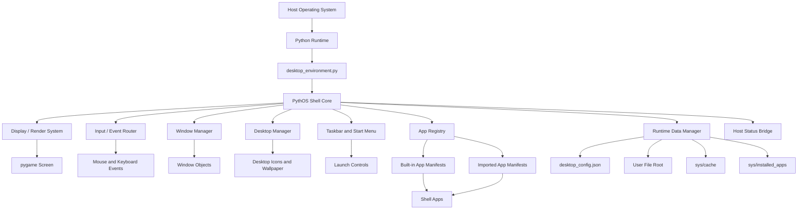
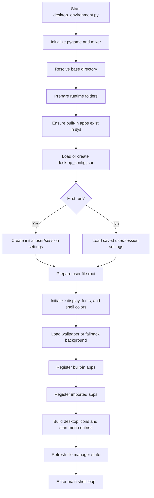
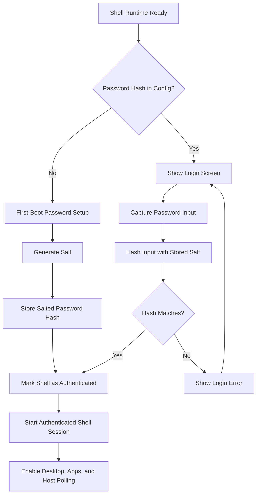
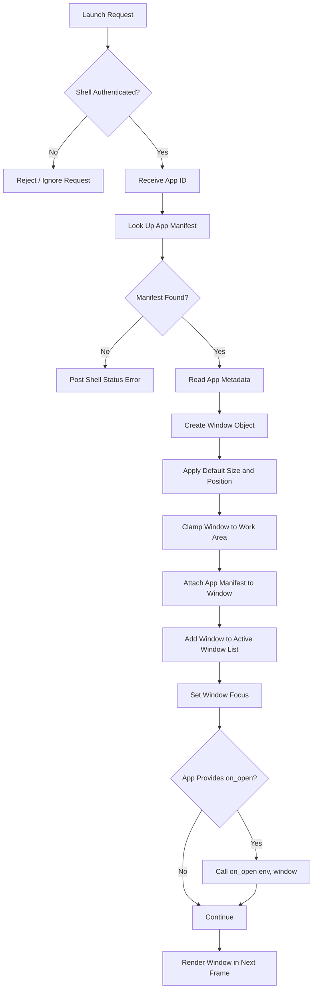
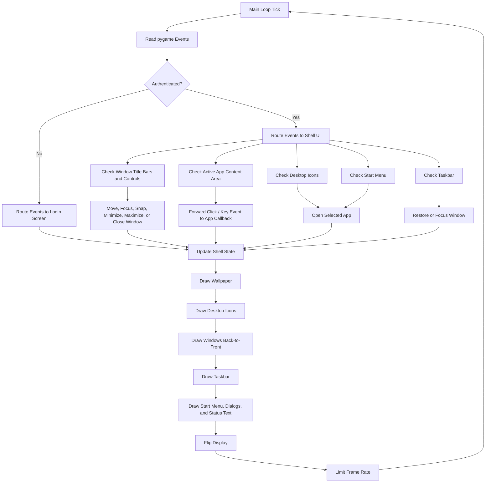

# PythOS Shell

> **PythOS Shell**, shortened as **PythOS**, is a Python-based desktop
> shell/runtime environment with an operating-system-style interface for
> modular Python programs.

PythOS Shell is an experimental desktop shell built with Python and
pygame. It includes a familiar desktop-style interface with windows,
desktop icons, a taskbar, a start menu, built-in utilities, a login gate,
and a lightweight Python app/plugin model.

**It is not meant to replace your standard OS.**

This project is being released as a open-source prototype, experimental tool
and portfolio architecture reference. Its purpose is to demonstrate desktop
shell design, modular Python app loading, UI state management, and
runtime-oriented software structure.

---

## Engineering Project Goal

PythOS Shell was built to show how a traditional desktop interface can be
modeled as a Python-based shell/runtime environment.

The engineering focus is:

- custom shell loop
- window management and desktop-style interaction
- app registration through Python modules
- event routing between shell systems and active apps
- runtime-created user/session data
- configuration persistence
- separation between shell systems, built-in apps, and imported apps

This project is not positioned as an operating system replacement. It is a
technical prototype showing how Python can act as the control layer for a
modular desktop-style environment.

---

## Current Features

| Area | Features |
|---|---|
| Shell UI | Wallpaper, desktop icons, taskbar, start menu, status text |
| Windows | Drag, focus, minimize, maximize, edge snap, title bars |
| Session | First-boot username setup, password-gated login screen |
| Apps | Built-in app registry and imported Python app support |
| Built-ins | File Manager, Text Editor, Calculator, Music Player, Terminal, Settings, About |
| Runtime | JSON config, local user file root, cache folders, installed app folder |
| Host Status | USB, network, and battery polling |
| UI Polish | Pixel-aware text fitting for visible shell menus and panels |

---

## Architecture and Flowcharts

The diagrams below are collapsed to keep the README readable. Open each
section to inspect the engineering flow.

<details>
<summary><strong>Architecture Overview</strong></summary>



PythOS Shell runs as a Python application on top of the host operating
system. The host OS still provides the kernel, filesystem, drivers,
process model, and hardware access. PythOS provides the desktop-like shell,
app windows, launcher behavior, shell state, and modular Python runtime.

</details>

<details>
<summary><strong>Runtime Startup Flow</strong></summary>



</details>

<details>
<summary><strong>Authentication Flow</strong></summary>



The login screen is a shell-level access gate. It is useful for session
flow and demonstration purposes, but it should not be presented as
operating-system-level authentication.

</details>

<details>
<summary><strong>App Launch Flow</strong></summary>



Apps are launched from desktop icons, the start menu, or shell actions.
The shell creates window objects and routes drawing/input callbacks through
the registered Python app manifest.

</details>

<details>
<summary><strong>Input and Render Loop</strong></summary>



The shell uses a continuous event/render loop. Each tick reads user input,
updates shell or app state, redraws the desktop, and presents the next
frame through pygame.

</details>

---

## Built-In Applications

| App | Purpose |
|---|---|
| About | Displays project and shell information. |
| Calculator | Provides a basic calculator inside the shell. |
| File Manager | Browses and manages files inside the user file root. |
| Music Player | Loads and plays local audio through pygame mixer. |
| Settings | Manages wallpaper, app visibility, shell info, and imported apps. |
| Terminal | Runs built-in commands and host shell commands. |
| Text Editor | Opens, edits, and saves text files. |

---

## App / Plugin Model

Apps are loaded through Python modules that expose a `register()` function.
The shell reads the returned manifest and uses it to place the app in the
start menu, on the desktop, and inside shell windows.

```python
def register():
    return {
        "id": "example_app",
        "name": "Example App",
        "title": "Example App",
        "window_size": (420, 300),
        "default_position": (120, 120),
        "draw": draw,
        "on_click": on_click,
        "on_key": on_key,
        "on_open": on_open,
        "show_on_desktop": True,
        "show_in_start_menu": True,
    }
```

| Callback | Purpose |
|---|---|
| `draw` | Draws the app interface inside the window content area. |
| `on_click` | Handles mouse clicks inside the app. |
| `on_key` | Handles keyboard input while the app is active. |
| `on_open` | Runs setup logic when the app opens. |

---

## Install and Run

Install dependencies:

```bash
python -m pip install -r requirements.txt
```

Run the shell:

```bash
python desktop_environment.py
```

Minimum dependency:

```text
pygame
```

`tkinter` is also used for native prompts and file dialogs. On some Linux
distributions, it may need to be installed separately through the system
package manager.

---

## Runtime Data and Hand-Off Notes

PythOS Shell creates runtime data while it runs. Review this data before
handing the project to another person or publishing a clean copy.

| Data / Folder | Purpose | Hand-Off Guidance |
|---|---|---|
| `desktop_config.json` | Local shell settings, username, wallpaper path, password hash/salt, visibility flags, and imported app settings. | Do not share a personal copy. Provide `desktop_config.example.json` or let the next user generate a new config. |
| User folder, such as `name/` or `users/<name>/` | Local user file root used by the shell and File Manager. | Remove from public releases unless intentionally providing sample files. |
| `sys/cache/` | Temporary shell/cache data. | Safe to clear before hand-off. Keep the folder if the program expects it. |
| `sys/installed_apps/` | Imported or user-installed Python app modules. | Clear for a clean release unless shipping example plugins. |
| `__pycache__/` and `*.pyc` | Python bytecode generated at runtime. | Remove before publishing. These files regenerate automatically. |

---

## Security Model

PythOS Shell is not a security boundary.

The project uses a salted SHA-256 password hash for the local shell login
gate. It also includes lightweight session-based file transformation for
files stored inside the shell user file root. This should be described as
basic local file obfuscation/encryption, not strong filesystem encryption.

PythOS Shell does **not** currently use containers, virtual machines,
namespaces, chroot isolation, or sandboxed app containers. Imported apps
are Python modules and should be treated as trusted code.

---

## Screenshots

<details>
<summary><strong>Click to Preview</strong></summary>
<br>
<br>
<br>
<br>
</details>

---

## Project Lifecycle and Future Direction

PythOS Shell is being published as a open-source prototype/experiment
for the Python shell/runtime layer.

The long-term direction will move from a Python shell running on top of an
existing host system toward a real bootable operating-system project.

---

## Name and Affiliation Notice

PythOS Shell is an independent project by James Deitz.

Python is a trademark of the Python Software Foundation. This project is
not affiliated with, endorsed by, or sponsored by the Python Software
Foundation.

---

## Portfolio Summary

PythOS Shell demonstrates custom desktop shell architecture in Python. It
shows window management, app registration, event routing, configuration
persistence, shell-level UI systems, and modular Python program loading.

The project is not meant to replace your standard OS. It is a technical
prototype showing how Python can build a portable, OS-style shell interface
on top of an existing host system.
